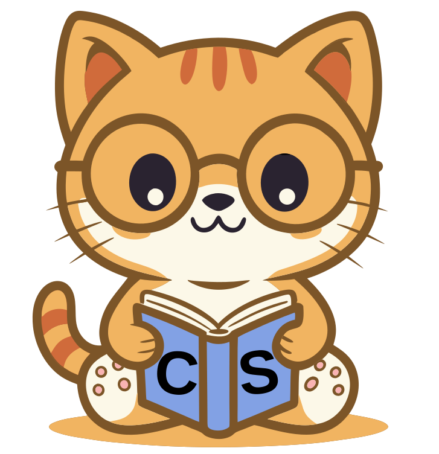

# ComputerScienceResources.com

[](https://github.com/AllanKoder/ComputerScienceResources.com/actions/workflows/feature-tests.yml)
[](https://github.com/AllanKoder/ComputerScienceResources.com/actions/workflows/lint.yml)

Welcome to the codebase for [ComputerScienceResources.com](https://computerscienceresources.com) — a curated platform for discovering, reviewing, and sharing the best resources in computer science and software engineering.

<p align="center">

    </br>
<em>This is our mascot, look how studious this little guy is!</em>
</p>

This website helps developers and learners find high-quality, structured, and community-reviewed resources across all areas of computer science. Our mission is to make learning easier by organizing and highlighting the best content, and to empower the community to contribute, review, and improve resource listings.


## App Features

Here's what you can do on ComputerScienceResources.com — all designed to make your learning journey easier:

- **Add New Resources:** Share your favorite computer science and software engineering resources with the world.
- **Upvote & Downvote:** Show your support (or not!) for resources, reviews, and comments. Change your mind? You can always update or remove your vote.
- **Write Reviews:** Leave thoughtful reviews for resources you’ve tried. Each user can post one review per resource, and reviews can be upvoted, commented on, and edited.
- **Comment Anywhere:** Start conversations on resources, reviews, or even other comments. Comments are nested, paginated, and easy to follow — just like your favorite forums: Reddit and Hackernews.
- **Suggest Edits:** See something that could be improved? Propose edits to any resource. The community can discuss, vote, and help merge the best changes.
- **Resource Filtering:** Filter resources by name, description, platform, difficulty, pricing, tags, upvotes, review scores, and more — so you always find what you need.
- **Community-Driven:** Everything is built to encourage helpfulness, kindness, and collaboration. Your feedback, reviews, and suggestions shape the site!

We’re always improving and adding new features. If you have ideas or want to help, check out the Contributing section below!

## Contributing

We welcome contributions! Please open issues or pull requests. For suggestions of features, please use the Discussions tab.

Don't be afraid to put up a PR or address any of the open issues in the tabs!

## Getting Started

This project uses [Laravel 11](https://laravel.com/) (PHP 8.4+) as the backend framework, with [Inertia.js](https://inertiajs.com/) and [Vue 3](https://vuejs.org/) for the frontend.

### Laravel Sail

We use [Laravel Sail](https://laravel.com/docs/11.x/sail) for easy setup and configuration. You will need to install [Docker Desktop](https://www.docker.com/products/docker-desktop/) to use Sail.
For detailed instructions, see the [Laravel Sail documentation](https://laravel.com/docs/11.x/installation#docker-installation-using-sail).


### Installation

1. **Clone the repository:**
   ```bash
   git clone https://github.com/AllanKoder/ComputerScienceResources.com.git
   cd ComputerScienceResources.com
   ```
2. **Install PHP dependencies:**
   ```bash
   composer install
   ```
3. **Install JS dependencies (via Sail):**
   ```bash
   ./sail npm install
   ```
4. **Copy and configure your environment:**
   ```bash
   cp .env.example .env
   # Edit .env to match your database and mail settings
   ```
5. **Generate app key:**
   ```bash
   ./sail artisan key:generate
   ```
6. **Run migrations:**
   ```bash
   ./sail artisan migrate
   ```
7. **Start the dev server:**
   ```bash
   ./sail npm run dev
   # In another terminal:
   ./sail up
   ```

Great, you should now see the webapp located in `localhost`

## Style Guide

We follow the [Laravel naming conventions](https://webdevetc.com/blog/laravel-naming-conventions/) for controllers, models, migrations, and more. Please:

### Casing

- Use `PascalCase` for class names (e.g., `ResourceReviewProcessed`).
- Use `snake_case` for database columns, migration files, and fields in request bodies.
- Use `camelCase` for variable and method names.
- Use `kebab-case` for vue prop inputs to components.

### Conventions
- Place business logic in Service classes or Actions, not controllers.
- Keep controllers thin and focused on HTTP concerns.
- Use [PSR-12](https://www.php-fig.org/psr/psr-12/) code style (enforced by Pint).

**Frontend:**
- Use [Vue 3](https://vuejs.org/) with [Inertia.js](https://inertiajs.com/)
- Use [Tailwind CSS](https://tailwindcss.com/) for styling
- Use Components from the `resources/js/Components` folder whenever possible. Such as `PrimaryButton.vue` and `SecondaryButton.vue`.
- Use `primary` and `secondary` colors for classes over raw hex values according to tailwind.config.js
    - Example: class='bg-primary'

## Packages Used & Why

This project uses several Laravel and community packages to enhance functionality:

- **cviebrock/eloquent-sluggable**: For generating SEO-friendly slugs for resources
- **inertiajs/inertia-laravel**: Enables server-driven SPA with Vue 3
- **joelbutcher/socialstream**: Social authentication (OAuth, etc.)
- **laravel/jetstream**: Authentication scaffolding and team management
- **laravel/sanctum**: API token authentication
- **shiftonelabs/laravel-cascade-deletes**: Handles cascading deletes for related models
- **spatie/laravel-activitylog**: Logs user activity for auditing and transparency
- **spatie/laravel-tags**: Flexible tagging for resources
- **tightenco/ziggy**: Exposes Laravel routes to JavaScript

**Dev Packages:**
- **barryvdh/laravel-debugbar**: Debugging and profiling
- **barryvdh/laravel-ide-helper**: IDE autocompletion for Laravel
- **beyondcode/laravel-query-detector**: Detects N+1 query issues
- **laravel/pint**: Automated code style fixing
- **laravel/telescope**: Debugging and monitoring (local/dev only)
- **worksome/request-factories**: Test request factories


See `composer.json` for the full list and version constraints.

## Running Tests

To run the test suite, use:

```bash
./sail test
```

By default, all tests are run. To speed up testing, you can exclude the slowest group (marked with `@Group('slow')`):

```bash
./sail test --exclude-group=slow
```

You can also run a specific test file or method:

```bash
./sail test tests/Feature/ResourceReviewsTest.php
```

## Local Debugging with Xdebug & VS Code

Xdebug is pre-configured in the Sail Docker environment for local debugging.

1. **Ensure Xdebug is enabled:**
   - By default, Xdebug is enabled in Sail via the `SAIL_XDEBUG_MODE` and `SAIL_XDEBUG_CONFIG` environment variables in your `.env` file.
2. **VS Code Setup:**
   - Install the [PHP Debug extension](https://marketplace.visualstudio.com/items?itemName=felixfbecker.php-debug).
   - Add a launch configuration to your `.vscode/launch.json`:

```json
{
  "version": "0.2.0",
  "configurations": [
    {
      "name": "Listen for Xdebug",
      "type": "php",
      "request": "launch",
      "port": 9003,
      "pathMappings": {
        "/var/www/html": "${workspaceFolder}"
      }
    }
  ]
}
```

3. **Start debugging:**
   - Set breakpoints in your PHP code.
   - Start the "Listen for Xdebug" configuration in VS Code.
   - Trigger a request (web, test, or CLI) and Xdebug will connect to VS Code.

## Deployment

We use Ansible with a `deploy.yaml` script, along with the inventory `production.ini`

`ansible-playbook -i ./ansible/inventory/production.ini deploy.yml`

## License

This project is open-sourced software licensed under the [MIT license](https://opensource.org/licenses/MIT).
