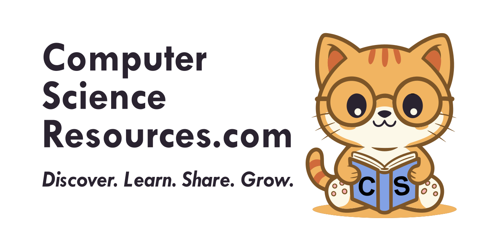

  

  
  
  

  <strong>A community-driven platform for discovering, reviewing, and sharing the best computer science learning resources.</strong>

## Welcome!

Our mission is simple: **make learning easier** by organizing the best content and empowering the community to contribute, review, and improve resource listings together.

     
<em>This is our mascot, look how studious this little guy is!</em>

ComputerScienceResources.com is a community platform where developers and learners discover, review, and share high-quality computer science resources. Browse curated content, read real reviews, discuss resources with others, and help improve the collection through collaborative editing and filtering.

## Contributing

We'd love your help making this project better! Whether you're fixing bugs, adding features, improving documentation, or just sharing ideas — all contributions are welcome.

**New to the project?** Check out our [CONTRIBUTING.md](CONTRIBUTING.md) guide to get started. We have issues labeled `good first issue` that are perfect for newcomers!

**Quick links:**
- [Report a bug](https://github.com/AllanKoder/ComputerScienceResources.com/issues/new)
- [Suggest a feature](https://github.com/AllanKoder/ComputerScienceResources.com/discussions)
- [Browse open issues](https://github.com/AllanKoder/ComputerScienceResources.com/issues)

Remember: this is a community built on **helpfulness**, **kindness**, and **collaboration**. Be respectful and supportive of fellow contributors!

## License

This project is open-sourced software licensed under the [GNU General Public License v3.0](https://www.gnu.org/licenses/gpl-3.0).
