# Application Routes & UI Previews

This document groups the main routes of ComputerScienceResources.com by category, with visual references for each. Screenshots or mockups should be stored in `docs/routes-images/`.

---

## Table of Contents
- [Resource-Related Routes](#resource-related-routes)
- [Comment-Related Routes](#comment-related-routes)
- [Voting Routes](#voting-routes)
- [Review Routes](#review-routes)
- [Other Routes](#other-routes)

---

## Resource-Related Routes

- `/` — Resources (redirects to resource index)
  - 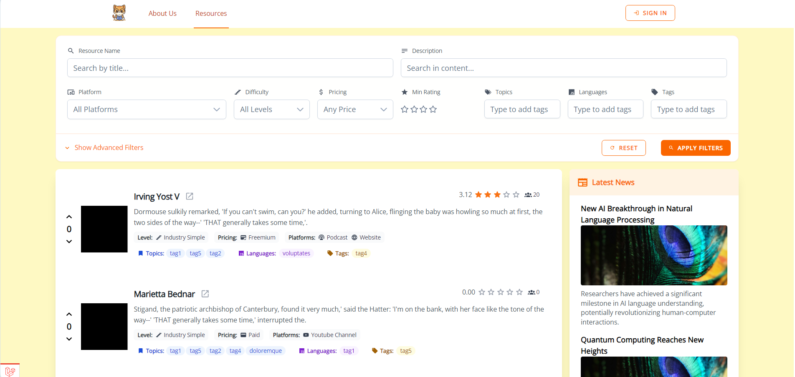
  - Filter Bar
    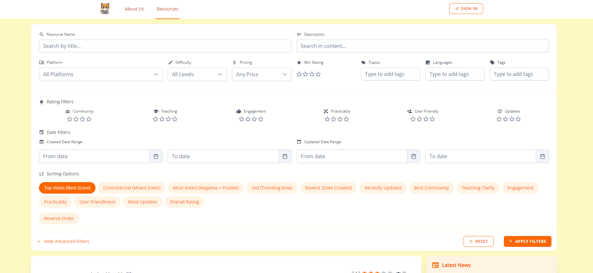
- `/about` — About page
  - 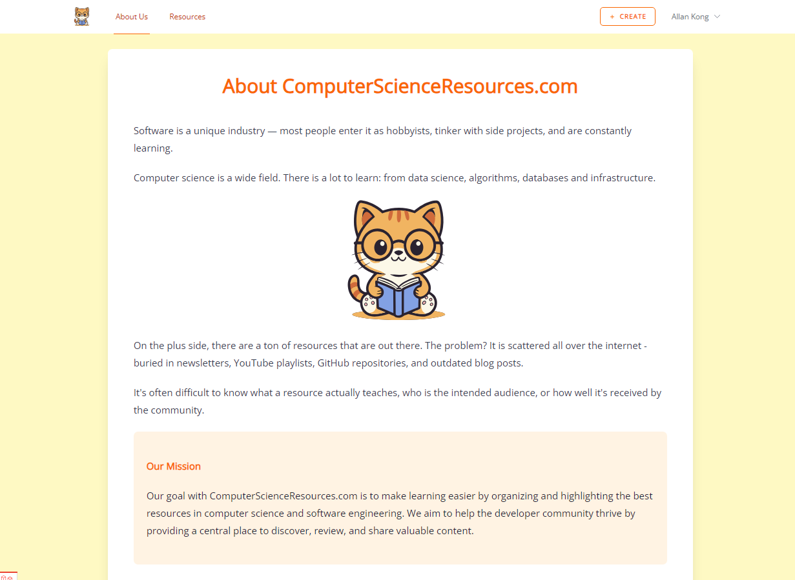
- `/resources/create` — Create a new resource
  - 
- `/resources/{slug}` — Resource details (reviews, comments, tags)
  - 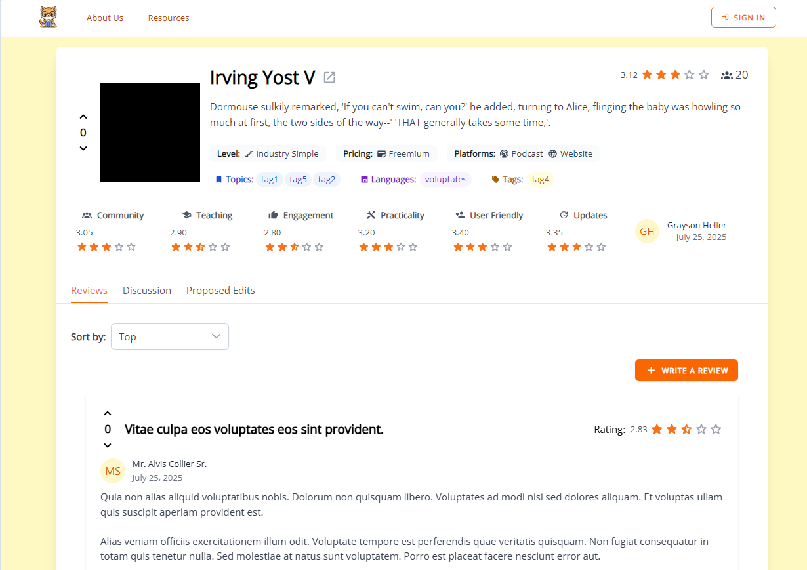
  - 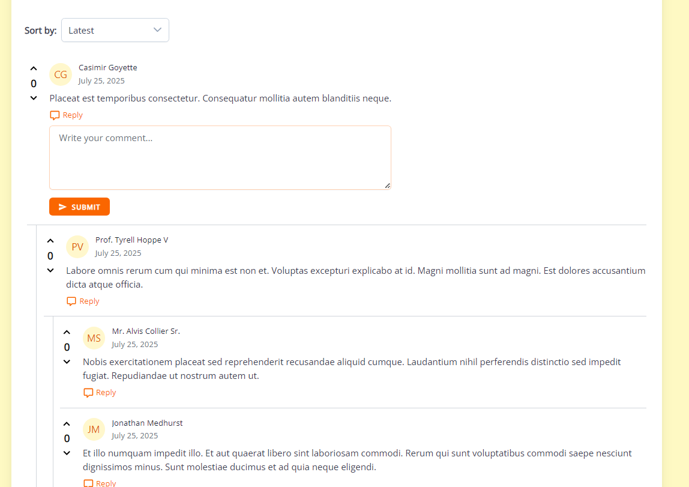
  - 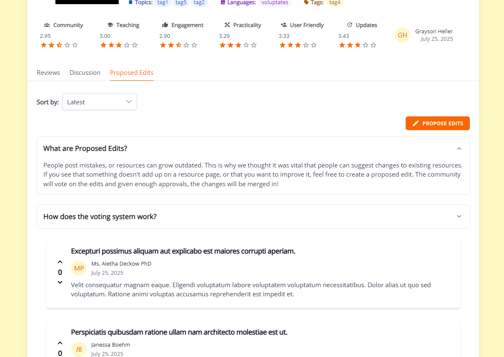
- `/resource/{slug}/edit/create` — Propose edits to a resource
  - 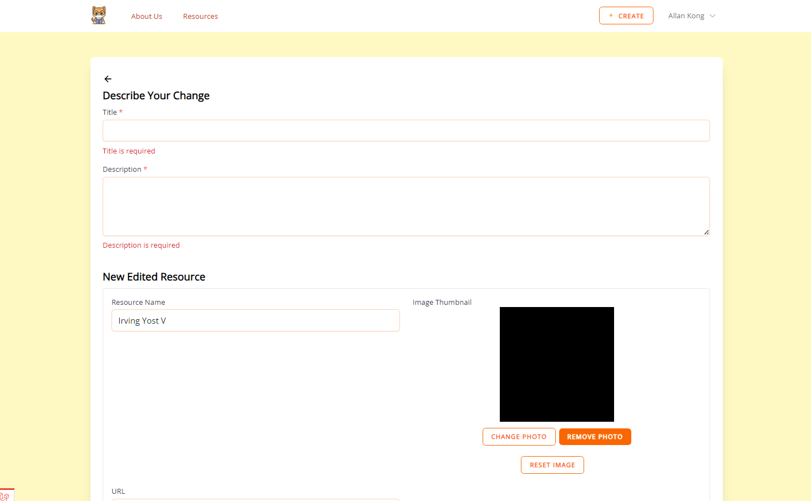
- `/resource/edit/{slug}` — View pending edits for a resource
  - 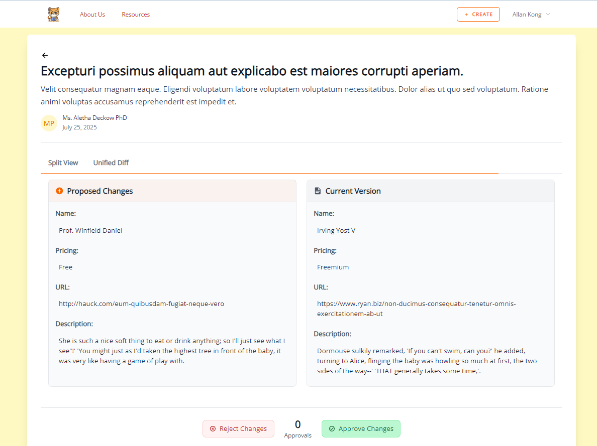
  - 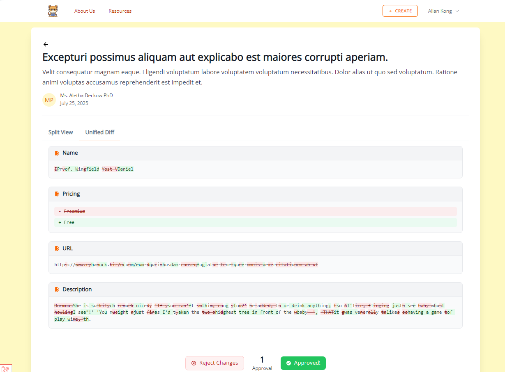

## Comment-Related Routes

- `/comments/show/{commentableKey}/{commentableId}/{index}/{paginationLimit?}` — Show paginated comments for a model
  - 
- `/comments` — Post a new comment (API)

## Voting Routes

- `/upvote/{typeKey}/{id}` — Upvote a resource, review, or comment (API)
  - 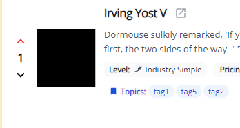
- `/downvote/{typeKey}/{id}` — Downvote a resource, review, or comment (API)
  - 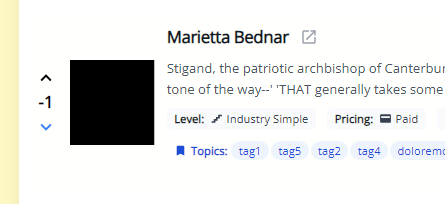

## Review Routes

- `/reviews/{computerScienceResource}` — Post or update a review (API)
  - 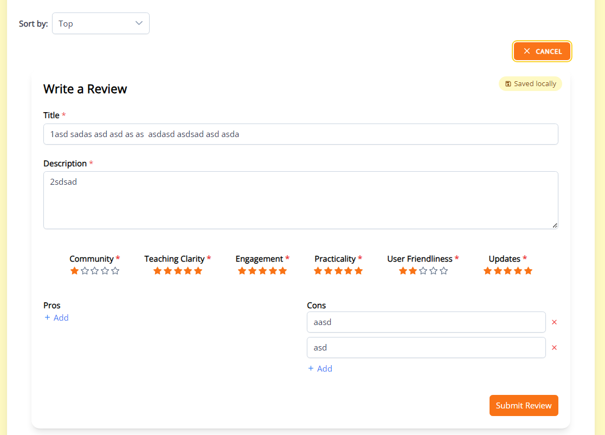

## Other Routes

- `/tags/search/{query}` — API endpoint for searching tags
  - 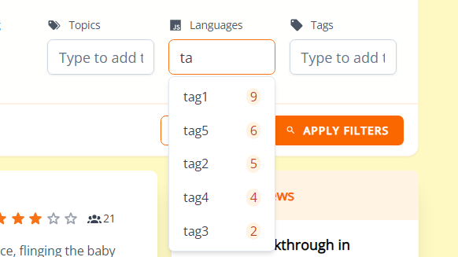

---

> To add or update screenshots, place image files in `docs/routes-images/` and update the image links above as needed.
